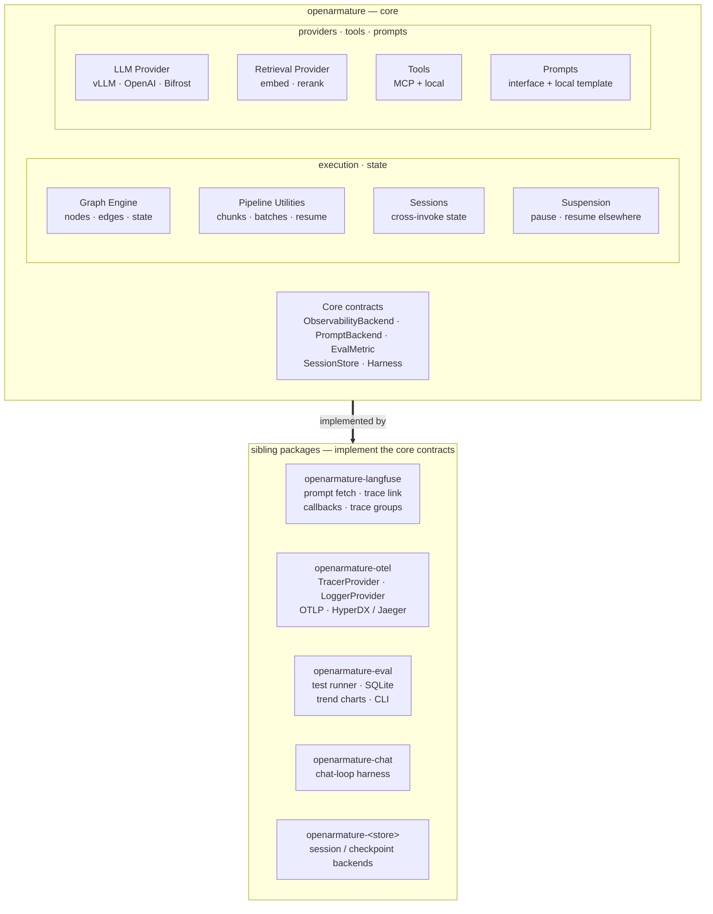

# OpenArmature

**A workflow framework for LLM pipelines and tool-calling agents.**

OpenArmature ships composable graph primitives — nodes, edges, typed state, conditional routing — plus the supporting
infrastructure production LLM work needs: prompt management, evaluation, observability, and MCP tool integration. One
framework for both deterministic LLM pipelines and tool-calling agents.

---

## 1. Thesis

### 1.1 The Gap: LLM Pipelines Have No Home

The current landscape for building production LLM systems splits cleanly into two camps, neither of which serves LLM
pipelines well:

**Agent frameworks** (LangChain/LangGraph, CrewAI, OpenAI Agents SDK, Claude Agent SDK, Pydantic AI, OpenAI Swarm) are
built around the tool-calling loop. State is typically a message list. Control flow is LLM-driven — the model decides
the next step. These frameworks are excellent for conversational agents and autonomous loops. They are awkward for
deterministic pipelines where the control flow is known up front and LLMs are one of several processing steps.

The friction is specific: a document extraction or content analysis pipeline doesn't need conversation history — it
needs structured data flow between stages. Forcing a deterministic sequence of LLM calls through a `MessagesState` or
`ToolNode` imposes a conversation abstraction on non-conversation work: token overhead for history that nothing reads,
and a loop-shaped control model where a linear sequence of typed Pydantic contracts would be clearer and cheaper.

**Pipeline orchestrators** (Prefect, Dagster, Airflow, Luigi) are built for deterministic ETL and workflow execution.
They have no LLM primitives, no prompt management, no observability for model calls, no eval. A team using one for an
LLM pipeline rebuilds prompt loading, structured-output repair, retry with context, token-aware rate limiting, and
cost/latency tracing from scratch.

The mismatches are specific, not cosmetic:

- **Rate limiting.** Generic orchestrators throttle by concurrent tasks. LLM providers throttle by tokens per minute.
  A concurrency limit of 8 can still hit a TPM ceiling when chunks vary in size.
- **Retry semantics.** Standard retry re-invokes the failed call. LLM failures often need something different — a
  retry with the validation error appended to the prompt, a fallback to a smaller model, a switch from JSON mode to
  text-plus-parse, or a regeneration with a higher temperature.
- **Semantic failure.** A task-level orchestrator reports success when the function returned without exception. LLM
  steps routinely succeed at the process level while producing garbage — a hallucinated JSON schema that breaks the
  next stage, a plausible-looking answer that fails evaluation. Observability that treats these as success is
  observability that hides the actual failure mode.

None of this is an oversight in the orchestrators. It is outside the scope those tools were designed for.

**LCEL is retired.** LangChain's pipeline DSL is being wound down. The chain-of-operations model did not survive —
developers rejected it for the same reason most DSLs fail: they wanted Python control flow (`for`, `if`, explicit
`await`), not pipe operators that hid the underlying `asyncio`. OpenArmature's bet is that Python-native graph
construction beats any DSL, no matter how elegant.

The work in the middle — content analysis pipelines, creator/lead sourcing, forecasting systems, large-scale data
enrichment, multi-stage extraction, document processing — is mostly deterministic with LLM steps for reasoning. It has
no dedicated framework. Teams doing this work either:

- Shoehorn into LangGraph with fake tool-calling loops
- Write raw `asyncio.gather()` with custom retry and checkpointing
- Glue Prefect + LangChain for message types and prompt loading
- Some combination of all three across the same codebase

This is not a new category. It is a major category that has simply been ignored.

### 1.2 The Insight: Pipelines and Agents Share Primitives

The reason the same framework can serve both is that the differences between LLM pipelines and tool-calling agents live
in node _content_, not in graph topology:

- **Pipelines**: nodes are mostly deterministic. A few use LLMs for structured extraction, classification, judgment.
  Control flow is known in advance.
- **Agents**: nodes include an LLM call and tool execution in a loop. Control flow is LLM-driven via conditional edges.

Both need:

- A typed state object that evolves across nodes
- Nodes as async functions with explicit inputs and outputs
- Conditional and static edges
- State reducers (append to list, merge dict, last-write-wins)
- Subgraphs and composition

Both benefit from the same supporting infrastructure:

- Structured output with automatic repair on validation failure
- Prompt management with version tracking and variable injection
- Typed inter-node contracts (Pydantic)
- Observability with ambient correlation IDs
- Evaluation framework with persistent history
- MCP-compatible tool integration

The graph primitives are agnostic. Topology does not care whether the LLM calls the next node or a conditional function
does.

### 1.3 What OpenArmature Proposes

A single workflow framework with:

1. **Graph primitives** — typed state, nodes as async functions, static and conditional edges, reducers, middleware,
   subgraphs. Works for pipelines (deterministic control flow) and agents (LLM-driven control flow).
2. **Pipeline-first utilities** — checkpoint/resume, batch processing with partial failure handling, rate limiting,
   structured-output repair, typed inter-stage contracts, per-item vs per-stage resource lifecycle. These are the
   patterns every LLM pipeline rebuilds.
3. **Production infrastructure** — prompt management with dual backends (Langfuse + local Jinja2), evaluation with
   persistent history, ambient observability, structured logging, MCP with cold-start handling and retry. These are
   non-optional for production LLM work.
4. **MCP-native tools** — discovery, schema conversion, cold-start handling, retry policy, session lifecycle are
   first-class. Remote and local tools use the same interface.
5. **Composable ecosystem** — core package plus sibling packages (`openarmature-eval`, `openarmature-langfuse`,
   `openarmature-otel`). Swap backends by installing a different sibling.

Target audience: teams building LLM pipelines. Non-LLM pipelines work as a byproduct. Tool-calling agents are a
first-class secondary use case.

---

## 2. Evidence

OpenArmature's design is informed by seven production projects. The framework is not a rewrite target for any of them;
the patterns below are distilled observations, not retrofits.

### 2.1 Projects Behind the Design

| Type                               | Key contribution                                                                                                                                              |
| ---------------------------------- | ------------------------------------------------------------------------------------------------------------------------------------------------------------- |
| Tool-calling agent                 | Glue-tax quantification: ~40% of the codebase bridging framework gaps (MCP production hardening, observability wiring, prompt DIY, eval-as-parallel-codebase) |
| LLM pipeline (content analysis)    | Prompt-pair pattern, multi-stage LLM pipeline with typed inter-stage contracts                                                                                |
| LLM pipeline (creator sourcing)    | Checkpoint/resumability, batch processing with incremental persistence, per-stage rerun from checkpoint                                                       |
| Non-LLM ML pipeline (GPU audio)    | Resource lifecycle management, per-item vs per-stage strategies, Ghost Track recovery                                                                         |
| Tool-calling agent (game)          | Tiered decision-making, conversation memory reconstruction from external state                                                                                |
| Minimal LLM pipeline (forecasting) | "Calculate first, reason second" — deterministic computation followed by LLM narrative generation                                                             |
| MCP tooling (CLI)                  | MCP server exploration, schema discovery, connection diagnostics                                                                                              |

### 2.2 Distilled Patterns

**Graph topology as a shared primitive.** Pipelines and agents both compose cleanly as directed graphs with typed state
and conditional edges. No project needed anything the graph model could not express.

**Checkpoint/resume is essential for pipelines.** Multi-hour runs fail at item 847 of 1,200. Restart from scratch is not
acceptable. Bird-Dog and Audio Refinery both built this independently. Pattern: checkpoint between stages, optionally
between items within a stage.

**Typed inter-stage contracts catch errors early.** Passing raw dicts between stages lets schema drift propagate
silently. Pydantic models at each stage boundary surface errors at the boundary, not three stages downstream.

**Structured-output repair is expected to fail sometimes.** A framework that does not retry with the validation error in
context is a framework that shifts this burden to every user.

**Per-item vs per-stage resource lifecycle matters.** Loading a 2 GB model per item wastes compute; loading it once per
stage holds GPU memory indefinitely. Both patterns are valid; the framework should make the choice explicit.

**Partial failure is the default.** In a 1,000-item batch, some items will fail. Pipelines should not halt unless
configured to. Per-item exceptions collected and reported without stopping the batch is the expected behavior.

**Rate limiting scope is composable, not fixed.** Provider/model TPM is the base layer (to avoid 429s — limits vary
by model, not just by provider). Pipelines frequently need finer scopes on top: per-node throttling to prevent a
high-fanout step from starving others on the same model, or per-prompt budgets when several prompts share a model but
have different cost/latency targets. The framework should let developers compose limiters at whichever scopes their
pipeline needs, not hard-code one.

**Ambient observability means no plumbing.** Correlation IDs, structured logs, and span creation should happen
automatically inside framework calls. The developer should never wire `contextvars` manually.

**Prompt management needs two backends.** Development uses local Jinja2 templates; production uses Langfuse (or similar)
for version tracking. The framework should handle the dual-source loading once, not in every prompt-using module.

**Evaluation runs against persistent history.** Score trends across runs matter more than single-run scores. Per-test
deltas show what changed between versions. A framework without persistence treats evaluation as a disposable check
rather than a development tool.

**MCP needs production hardening.** Cold starts, retry policies, session refresh on broken pipes, extended timeouts,
sanitized error propagation. The base MCP adapters in the ecosystem solve translation, not production.

**"Calculate first, reason second" is a common architecture.** Deterministic computation produces structured inputs; the
LLM generates narrative or interpretation. The framework should make the boundary explicit, not hide LLM calls inside a
"smart" pipeline step.

---

## 3. Architecture

### 3.1 Design Principles

**1. LLM pipelines and agents share primitives.** The graph engine is agnostic to whether control flow is LLM-driven or
deterministic. Pipeline utilities are first-class in core, not an afterthought. Agents work with the same primitives.

**2. The engine is content-agnostic.** A node is an opaque IO boundary — a black-box async function that returns a
partial update. The engine has no concept of LLMs, tools, or external systems, so validation, retry, and recovery of
external inputs (JSON parsing, schema drift, truncated responses, timeouts) are node-internal concerns.
`NodeException` with `recoverable_state` is the crash-context primitive; patterns built on top (retries, graceful
degradation, circuit breakers) belong at the user level or in pipeline utilities, not the engine.

**3. Focused core, composable ecosystem.** The core handles orchestration, state, LLM abstraction, tool dispatch, and
prompt interfaces. Evaluation, observability backends, and provider integrations live in sibling packages. Swap a
backend by installing a different sibling.

**4. MCP-native.** Tool discovery, calling, retry, cold-start handling, and transport management are first-class in
core. Remote and local tools use the same `ToolSet` interface.

**5. Ambient observability via interfaces.** The core defines observability contracts (trace context, span creation,
correlation IDs) and provides instrumentation automatically. Specific backends (Langfuse, OTEL/HyperDX, Datadog)
implement the contracts. Switching backends is a package swap.

**6. Evaluation as a sibling, not built-in.** Metric base classes and `EvalCase` live in core. The test runner, SQLite
persistence, trend charts, and CLI live in `openarmature-eval`. This keeps core dependency-light while making eval a
first-class ecosystem citizen.

**7. No built-in prompts.** The framework never embeds hidden prompt text that shapes LLM behavior. No ReAct templates,
no default personas. Every prompt the LLM sees is authored by the developer.

**8. Transparency over abstraction.** The framework adds structure but never hides what's underneath. Provider
responses, exception causes, intermediate state, and routing decisions are exposed alongside their normalized views —
not behind escape hatches, but as first-class fields users can read directly. Hiding implementation details from users
hides failures from users; OpenArmature defaults the other way. Principle 7 ("No built-in prompts") is one specific
case of this rule; the rule itself is general.

**9. Escape hatches everywhere.** Every default can be overridden. The framework handles the common case; developers
handle the exceptional case.

### 3.2 Package Structure

```
openarmature                  Core: graph, state, LLM + retrieval providers, tool dispatch, prompt interfaces, sessions + suspension, pipeline utilities, harness contract, logging
openarmature-eval             Eval: test runner, metrics, SQLite persistence, trend charts, CLI
openarmature-langfuse         Langfuse: prompt loading backend, trace linking, callback handler
openarmature-otel             OTEL: TracerProvider, LoggerProvider, HyperDX/Jaeger/Grafana exporters
openarmature-chat             Chat harness: the canonical chat-loop deployment on the core harness contract
openarmature-<store>          Session / checkpoint backends for production stores (Redis, Postgres, DynamoDB)
```

Core dependency footprint: `httpx`, `pydantic`, `structlog`, `jinja2`. No database drivers, no plotting libraries, no
provider-specific SDKs.

**Install patterns:**

```bash
# LLM pipeline with OTEL export + evaluation
pip install openarmature openarmature-otel openarmature-eval

# Agent with Langfuse
pip install openarmature openarmature-langfuse

# Chat harness with sessions + Langfuse
pip install openarmature openarmature-chat openarmature-langfuse

# Minimal
pip install openarmature
```

### 3.3 Architecture Diagram



---

## 4. Module Specifications

This section summarizes each module's scope, core abstractions, and key design decisions.

### 4.1 Graph Engine

**Scope.** Typed state, nodes as async functions, static and conditional edges, reducers, middleware, subgraph
composition, async compilation. Owns the typed observer event union the observability layer consumes.

**Core abstractions.** `Graph`, `State`, `Message`, `Node`, `Edge`, reducers (`append_messages`, `merge_dict`,
`last_write_wins`, custom). The typed observer event stream — `NodeEvent` plus the LLM, embedding, rerank, tool, and
token-budget event variants — is emitted from here.

**Key decisions.**

- State is a Pydantic model, not an untyped dict
- Node signature: `async def node(state: StateT) -> dict` (returns partial update)
- Edges are Python callables returning the next node name or `Graph.END`
- Subgraphs compose as single nodes; parent state flows in and out
- Middleware wraps nodes (logging, retry, timing) without changing node signatures
- Execution emits a typed event stream that observers consume — the substrate the observability layer maps onto
  spans, logs, and metrics

### 4.2 Pipeline Utilities

**Scope.** The patterns that every LLM pipeline rebuilds. First-class in core because LLM pipelines are the target
audience.

**Core abstractions.**

- `@step` decorator for pipeline stages with typed input/output contracts
- `StepRegistry` for discovery and ordering
- `Checkpoint` for persistence between stages (and optionally between items)
- `batch_process()` — async batch executor with partial failure collection, rate limiting, progress reporting
- `chunk_with_overlap()` — text chunking with configurable overlap for context continuity
- `structured_output()` — wrapper that retries on Pydantic validation failure with error context
- `RateLimiter` — token-bucket with composable scopes (per-model, per-node, per-prompt) that stack
- `ResourceLifecycle` — context manager for per-stage resource loading (GPU models, connection pools)

**Key decisions.**

- Checkpoints are opt-in per step; steps declare whether they are checkpointable
- Partial failure is the default; users configure fail-fast when they want it
- Rate limiters compose: a per-model limiter (base layer for provider 429 avoidance) can stack with per-node or
  per-prompt limiters (for fairness and cost control within a pipeline). The framework enforces the strictest active
  scope at each call site
- Resource lifecycle is explicit: per-item (load each call) or per-stage (load once, reuse)

### 4.3 Sessions

**Scope.** Named, typed state records that persist across multiple `invoke()` calls under a stable caller-supplied
identifier — the contract for multi-turn and resumable workloads that outlive a single invocation.

**Core abstractions.** `SessionStore` protocol, `SessionRecord`, per-graph registration (`with_session_store(...)`).
Reference implementations bundle an in-memory and an embedded-database (SQLite) backend; production stores (Redis,
Postgres, DynamoDB) layer in as sibling packages.

**Key decisions.**

- Loaded session state REPLACES the supplied initial state; callers needing merge logic do it explicitly
- Lifecycle hooks, typed schema migration, and a defined concurrency policy are part of the contract
- Session identity propagates into observability (session grouping on the trace)
- The protocol is core; production stores are siblings, mirroring the checkpointer pattern

### 4.4 Suspension

**Scope.** How an in-progress invocation intentionally pauses at a node, persists its state under a typed signal
descriptor, and later resumes — merging a resume payload into state. The load-bearing case is stateless workers:
suspend on one machine, resume on another with nothing held in worker memory between.

**Core abstractions.** `suspend(...)` invoked from inside a node body; a typed suspension signal descriptor; a
paused-invocation record reusing the same persistence mechanism as checkpointing.

**Key decisions.**

- The engine recognizes a `suspended` outcome from a node, halts the invocation cleanly, and persists resumable state
- Resume merges a typed payload into state and continues from the suspension point
- Designed for stateless deployment: no worker affinity between suspend and resume
- Composes with sessions and checkpointing; shares their persistence backends

### 4.5 LLM Provider Abstraction

**Scope.** Uniform, intentionally narrow, stateless request/response surface over local (vLLM, Ollama, LM Studio)
and remote (OpenAI, Anthropic, Google, Bifrost) providers — one `complete()` call, no history, no tool loop, no
retry or routing. Covers content blocks and multimodal input, structured output, tool-choice, streaming, and
per-provider wire-format mappings.

**Core abstractions.** `LLM`, `Message` (system, user, assistant, tool), content blocks, `ToolCall`, normalized
`finish_reason`, provider presets (`LLM.vllm(...)`, `LLM.openai(...)`, `LLM.anthropic(...)`, `LLM.bifrost(...)`).

**Key decisions.**

- Pre-flight health check with explicit `ready()` method — agents and pipelines fail fast on missing models
- Structured output returns a parsed instance; a parse-or-validate failure surfaces as a typed failure carrying the
  raw response and its diagnostics
- `tool_choice` constrains the request; the response is reported exactly as the provider sent it
- Normalized `finish_reason` (`stop` / `length` / `tool_calls` / `content_filter` / `error`) is uniform across providers
- Streaming is a first-class response mode alongside unary completion
- Per-provider wire-format mappings (OpenAI-compatible, Anthropic, Gemini) are specified in the spec, not reinvented
  per implementation
- No hidden prompts; system messages are always explicit. Config overrides compose, not mutate

### 4.6 Retrieval Provider

**Scope.** Retrieval-primitive provider operations — a sibling capability to LLM Provider, not a subtype: turning
text into embedding vectors, and re-scoring candidate documents against a query. The first member of the
`<domain>-provider` family.

**Core abstractions.** `EmbeddingProvider` (`ready()` + `embed(list[str]) -> EmbeddingResponse`) and `RerankProvider`
(`ready()` + `rerank(query, documents, *, top_k=None) -> RerankResponse` of relevance-sorted `ScoredDocument`
entries). Paired typed events on the graph-engine event union (`EmbeddingEvent` / `RerankEvent` and their failure
variants).

**Key decisions.**

- The same narrow, stateless surface as LLM Provider — `ready()` plus a single call, no orchestration
- A cross-vendor `input_type` knob (query vs document) for embeddings
- Per-provider wire-format mappings specified in-spec (TEI, Jina, OpenAI-compatible, Cohere), with a cross-mapping batch-chunking rule for over-cap embedding calls
- Provider payloads carry the same privacy posture as LLM payloads, suppressible via the shared provider-payload flag
- Observability maps onto dedicated Langfuse `Embedding` and `Retriever` observation types and an OTel GenAI
  semantic-convention subset, with operation-discriminating span names

### 4.7 Tool System and MCP

**Scope.** Unified tool interface for local Python functions and remote MCP tools. Production-grade MCP: discovery,
retry, cold-start handling, session lifecycle, schema conversion.

**Core abstractions.** `ToolSet`, `@tool` decorator, `MCPToolSet`, `LocalToolSet`, `ToolResult`.

**Key decisions.**

- MCP discovery generates tool schemas at runtime (no hand-written schemas)
- Cold-start handling: configurable health-check loop before MCP connection
- Retry policy: classified exceptions (`HTTPStatusError`, `BrokenResourceError`, `ClosedResourceError`) with appropriate
  response (retry with fresh session, fail fast, sanitize error)
- Timeouts: separate init, operation, discovery timeouts
- Error sanitization: framework strips tracebacks from tool errors before returning to LLM

### 4.8 Prompt Management

**Scope.** Dual-source prompt loading (Langfuse for production, local Jinja2 for development), variable injection with
`StrictUndefined`, per-prompt sampling and token-budget config, and the prompt-group pattern for tracing related
prompts together.

**Core abstractions.** `PromptManager`, `Prompt`, `PromptResult`, `PromptGroup`, `LabelResolver`. Backends implement
the `PromptBackend` interface.

**Key decisions.**

- `StrictUndefined` by default — unbound variables raise immediately instead of rendering empty strings
- Langfuse backend (sibling package) fetches by name and label; local backend reads from filesystem; a per-fetch
  cache TTL bounds staleness
- Each prompt may carry sampling parameters (mirroring `RuntimeConfig`) and an advisory, observability-only
  `token_budget` (input / total ceilings) that never alters the request
- Fallback: if Langfuse fetch fails, fall back to local template with warning
- PromptGroup: an ordered sequence of two or more related prompts (classifier + follow-up, multi-stage classification, RAG with reranking, self-correction loops), traced together under one shared `group_name`

### 4.9 Observability

**Scope.** Maps OA execution onto OpenTelemetry spans, logs, and metrics plus a Langfuse backend mapping: ambient
correlation IDs, a span hierarchy mirroring graph structure, GenAI semantic-convention attributes, per-operation
spans (LLM, embedding, rerank, tool), caller-supplied invocation metadata, and metrics histograms. Provider isolation
avoids Langfuse v3 + OTEL span duplication.

**Core abstractions.** Typed observers over the graph-engine event union; the OTel mapping (`TracerProvider`,
`LoggerProvider`, metrics instruments) and the Langfuse mapping (`Trace`, `Generation`, `Span`, `Event`, `Embedding`,
`Retriever`, `Tool` observation types). Backends: `openarmature-langfuse`, `openarmature-otel`.

**Key decisions.**

- Correlation IDs via `ContextVar`, set once per invocation and propagated through all async calls automatically
- `TracerProvider` is isolated (not global) to prevent Langfuse v3 from duplicating spans through the global OTEL
  pipeline
- Instrumentation happens inside framework calls; user code never touches `set()`/`reset()` on context tokens
- GenAI semantic-convention attributes are adopted normatively, with a defined policy for upstream-unstable names
- Caller-supplied invocation metadata propagates cross-cuttingly; recognized session / user keys promote to native
  trace fields
- Opt-in GenAI metrics (token usage, operation duration) and a per-prompt token-budget signal (span attribute +
  WARNING log + metrics) ride the same event stream
- Structured-output parse failures surface response-side diagnostics (raw content, `finish_reason`, usage) on the
  failure event, not just an error category
- Session grouping, flush-on-exit, and callback registration are backend responsibilities

### 4.10 Evaluation

**Scope.** Deterministic and LLM-judge metrics, persistent history, per-test deltas, trend charts. Lives in
`openarmature-eval`; base classes live in core.

**Core abstractions.** `DeterministicMetric`, `LLMJudgeMetric`, `EvalCase`, `EvalRun`, `EvalReport`.

**Key decisions.**

- SQLite persistence (WAL mode, foreign keys, idempotent migrations)
- Per-test delta tracking: previous scores queried by `test_id` to show what changed
- Prompt version tracking: current Langfuse versions stored in `runs` table
- Dual-path evaluation: structured output (tool calls as JSON) and natural language responses stored separately, queried
  by different metric types

### 4.11 Logging

**Scope.** Structured logging via structlog, noisy-library suppression, correlation ID enrichment.

**Core abstractions.** `configure_logging()` sets up structlog with JSON output in production, console output in
development. Correlation IDs auto-injected from observability context.

**Key decisions.**

- Known noisy loggers (`httpx`, `openai`, `langfuse`, `urllib3`, ...) are suppressed by default; user can override
- Log records carry correlation ID automatically via `contextvars` integration
- No configuration required for the common case; one call in `main()` configures everything

### 4.12 Harness and Deployment

**Scope.** The abstract contract a harness follows when wrapping the OA engine to serve a deployment runtime — HTTP
server, event bus, queue worker, or CLI repl: turn semantics, inbound dispatch-path classification, turn-boundary
error categorization, and the sessioned-vs-stateless mode distinction. A chat-shaped sub-spec layers the canonical
chat-loop deployment on top.

**Core abstractions.** The abstract harness contract (turn lifecycle, dispatch classification, composition with
sessions and suspension); the chat sub-spec's `ChatMessage` shape, conversation-history convention, and
send-and-reply surface with suspension / HITL handling. Concrete harnesses ship as sibling packages
(`openarmature-chat`, plus platform integrations for HTTP frameworks, event / queue runtimes, and CLIs).

**Key decisions.**

- The contract is runtime-agnostic: request/response, event-driven, and queue-worker deployments map onto the same
  turn semantics
- Sessioned vs stateless is an explicit mode distinction; the chat sub-spec is sessioned-mode only
- Suspension and human-in-the-loop pauses compose with the harness turn boundary
- Concrete harnesses and platform adapters are siblings, not core

### 4.13 Conformance Adapter

**Scope.** The language-agnostic conformance system every implementation builds against — the meta-capability that
makes "same behavior across languages" verifiable rather than aspirational. Defines the fixture file schema, the
directive vocabulary, the harness primitives an implementation must provide, and the per-language adapter pattern
that runs the shared fixtures as host-runtime tests.

**Core abstractions.** The fixture file schema and directive vocabulary; the conformance harness primitives (mock
provider injection, typed-event collectors, span-tree capture, metric capture); the per-language adapter that maps
fixtures onto a native test runner. Composes with every capability's `conformance/` directory.

**Key decisions.**

- Conformance fixtures are the source of truth for behavior; the prose spec states intent, the fixtures pin it
- One fixture, many runtimes: a fixture that passes proves behavior matches every other conforming implementation
- Harness primitives are specified so every implementation exposes the same test seams (mock injection, event and
  span capture) regardless of language

---

## 5. Canonical Examples

### 5.1 LLM Pipeline (Content Analysis)

```python
from openarmature import Graph, State, step, batch_process, LLM, PromptManager
from pydantic import BaseModel

class TranscriptChunk(BaseModel):
    start: float
    end: float
    text: str

class Analysis(BaseModel):
    themes: list[str]
    sentiment: str
    key_claims: list[str]

class PipelineState(State):
    video_url: str
    transcript: str = ""
    chunks: list[TranscriptChunk] = []
    analyses: list[Analysis] = []

graph = Graph(PipelineState)
llm = LLM.anthropic(model="claude-sonnet-4-6")
prompts = PromptManager.from_env()

@graph.node
async def fetch_transcript(state: PipelineState) -> dict:
    transcript = await fetch_youtube_transcript(state.video_url)
    return {"transcript": transcript}

@graph.node
async def chunk_transcript(state: PipelineState) -> dict:
    chunks = chunk_with_overlap(state.transcript, size=2000, overlap=200)
    return {"chunks": chunks}

@graph.node
@step(checkpointable=True)
async def analyze_chunks(state: PipelineState) -> dict:
    prompt = prompts.get("analyze_chunk")
    async def analyze(chunk: TranscriptChunk) -> Analysis:
        return await llm.structured_output(
            schema=Analysis,
            messages=[prompt.render(chunk=chunk.text)],
        )
    analyses = await batch_process(
        items=state.chunks,
        worker=analyze,
        concurrency=8,
        on_error="collect",
    )
    return {"analyses": analyses.successful}

graph.add_edge("fetch_transcript", "chunk_transcript")
graph.add_edge("chunk_transcript", "analyze_chunks")
graph.add_edge("analyze_chunks", Graph.END)

pipeline = graph.compile()
result = await pipeline.invoke(PipelineState(video_url="https://..."))
```

Control flow is deterministic. LLM calls are scoped to the `analyze_chunks` step. Checkpointing lets a failed run resume
from `chunk_transcript` without refetching. Batch processing handles partial failures without halting.

### 5.2 Tool-Calling Agent

```python
from openarmature import Graph, State, Message, LLM, MCPToolSet

class AgentState(State):
    messages: list[Message]

graph = Graph(AgentState)
llm = LLM.bifrost(model="claude-sonnet-4-6")
tools = await MCPToolSet.connect(url="https://tools.example.com/mcp")
llm.bind_tools(tools)

@graph.node
async def agent(state: AgentState) -> dict:
    response = await llm.chat([prompts.get("system"), *state.messages])
    return {"messages": [response]}

@graph.node
async def execute_tools(state: AgentState) -> dict:
    results = await tools.execute(state.messages[-1].tool_calls)
    return {"messages": results}

@graph.edge(from_="agent")
def route(state: AgentState) -> str:
    return "execute_tools" if state.messages[-1].tool_calls else Graph.END

graph.add_edge("execute_tools", "agent")

compiled = graph.compile()
result = await compiled.invoke(AgentState(messages=[Message.user("Find me flights to Tokyo")]))
```

Same graph primitives. Control flow is LLM-driven via the conditional edge. MCP connection, cold-start handling, schema
discovery, and retry are managed by the framework.

### 5.3 Hybrid (Pipeline with Agent Step)

```python
# Pipeline that dispatches to an agent for one investigative step.
# Example: a lead-enrichment pipeline that uses an agent to research
# ambiguous companies via multiple tool calls.

@graph.node
async def research_ambiguous(state: PipelineState) -> dict:
    agent = load_research_agent()  # a compiled subgraph
    enriched = []
    for lead in state.ambiguous_leads:
        result = await agent.invoke(
            AgentState(messages=[Message.user(f"Research {lead.company}")])
        )
        enriched.append(merge_lead(lead, result))
    return {"enriched_leads": enriched}
```

The agent is a compiled subgraph. It plugs into the pipeline as a single node. The pipeline's checkpoint captures the
agent's results; a failed run resumes without re-invoking the agent for already-researched leads.

---

## 6. Multi-Language Strategy

OpenArmature ships Python first, TypeScript second, via **parallel implementations with a shared specification**.

**Approach.** Maintain a language-agnostic specification (design spec + wire-protocol definitions + conformance test
suite) that both implementations target. Each language gets an idiomatic implementation. This is the pattern LangChain,
LlamaIndex, and Vercel's AI SDK use.

**Why this pattern wins over alternatives.**

- **FFI** (Python core + TS binding): idiomatic mismatch, build complexity, stack traces cross language boundaries
- **Codegen from a single source**: works for protocols (protobuf, OpenAPI) but not for idiomatic frameworks. Generated
  Python feels like TypeScript and vice versa
- **Parallel implementations with spec**: each language is idiomatic; spec keeps them aligned on behavior, not
  implementation

**Release sequencing.**

1. Python v0 → v1: build and ship core + eval + langfuse + otel
2. Extract spec from v1: design spec, wire-protocol definitions, conformance test suite
3. TypeScript v0 → v1: build against the spec, validate with the conformance suite
4. Synchronized releases thereafter

**Repo structure.** Separate repos (`openarmature-python`, `openarmature-typescript`, `openarmature-spec`) rather than a
monorepo. Different language tooling, different contributor pools, different release cadence in practice.

**Risks.**

- TypeScript never ships (Python absorbs all attention) — mitigate by extracting the spec as an explicit artifact
- Spec drift between implementations — mitigate by requiring conformance tests to pass before either language releases
- Idiom mismatch (e.g., Python decorators vs TS middleware) — accept that APIs will differ in syntax while matching in
  behavior

---

## 7. Implementation Plan

### 7.1 Phasing

> **Status.** The plan below has been followed through spec extraction — the language-agnostic specification
> and its conformance suite are the artifact this repository holds, and a reference implementation builds
> against them. The specified surface has grown past the v0–v2 module list (see §4 and the per-capability
> specs for the current scope); the phases remain as the rationale for the build order.

**v0 — Graph + Pipeline Utilities.** Ship the graph engine and pipeline utilities. Enough to build a working LLM
pipeline end-to-end with basic LLM provider abstraction. No MCP, no eval, no observability yet. Goal: validate the core
primitives against two or three real pipeline builds.

**v1 — LLM Provider + Tools + MCP.** Add production-grade LLM abstraction (local + remote providers, structured output
with repair) and the tool system with MCP support (discovery, retry, cold-start handling). Goal: the framework can build
a tool-calling agent, not just a pipeline.

**v2 — Supporting Infrastructure.** Add prompt management, observability (core interfaces + `openarmature-langfuse` +
`openarmature-otel`), structured logging. This is where the "glue tax" savings materialize. Goal: a real production
deployment can use OpenArmature end-to-end.

**v3 — Evaluation + Ecosystem.** Ship `openarmature-eval` with test runner, SQLite persistence, trend charts, CLI. Build
local dev tooling (mock MCP servers, prompt REPL). Extract the spec and begin TypeScript port.

### 7.2 Risks

**Scope too broad for a small team.** Mitigation: phasing above. Each phase produces a shippable artifact that is useful
on its own.

**Graph engine is overkill for simple pipelines.** Mitigation: pipeline utilities work without explicit graph
construction for straightforward linear flows. The graph is the escape hatch for complex topology, not the only way in.

**MCP ecosystem instability.** Mitigation: core interfaces abstract transport; new MCP transports slot in as ToolSet
backends.

**Observability backend lock-in.** Mitigation: observability is interface-first. Backends are swappable siblings.

**TypeScript port never ships.** Mitigation: extract the spec as an explicit artifact in v3; build the conformance test
suite as part of v3 so TS work has a clear target.

**Eval framework duplicates DeepEval.** Mitigation: `openarmature-eval` focuses on persistence, trends, and
LLM-pipeline-specific metrics. Integration with DeepEval metrics as adapters is an option, not a replacement.

### 7.3 What Is Hard

**Graph engine semantics.** State reducers, subgraph composition, middleware ordering, and conditional edges interact.
Getting the model right before shipping is critical — changes post-v0 will break users.

**Pydantic validation feedback loop.** Structured-output repair needs the validation error in the retry prompt. Making
this automatic, language-model-aware, and low-friction requires care.

**MCP production hardening.** Cold-start handling, session lifecycle, and retry classification are ecosystem-dependent.
Testing against real MCP servers (not mocks) during v1 is essential.

**Observability provider isolation.** The Langfuse v3 / OTEL span duplication trap is subtle. The framework needs to
prevent it by default without blocking users who want a shared TracerProvider.

**Spec extraction without Python leakage.** When the spec is written, Python idioms (decorators, async generators,
context managers) should not leak into the protocol. The spec describes behavior; each language implements idiomatically.
